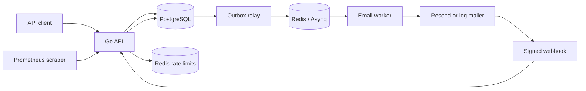
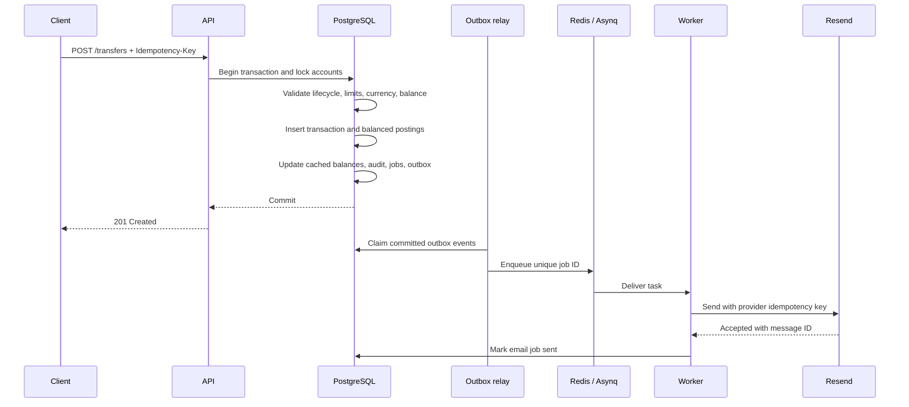

# Monierave

Monierave is a production-like banking backend built as a Go learning project.
It demonstrates account lifecycle controls, secure sessions, an append-only
double-entry ledger, idempotent transfers, transactional notifications,
financial audit trails, reconciliation, and operational hardening.

This repository is not a licensed bank and must not be used to hold or move
real money.

## What is implemented

- User signup, login, email verification, profile updates, and safe logout.
- Short-lived JWT access tokens and rotating refresh tokens in HTTP-only cookies.
- Refresh-token reuse detection and database-backed session revocation.
- Public account UUIDs with active, frozen, and closed lifecycle states.
- Append-only double-entry ledger postings and cached account balances.
- Operator-only simulated deposits, withdrawals, freezes, unfreezes, and reversals.
- Idempotent internal transfers with per-transfer and daily limits.
- Beneficiaries, transaction history, statements, and stable cursor pagination.
- Transactional outbox delivery through Redis and Asynq.
- Resend email delivery, signed webhooks, bounce tracking, retries, and a DLQ.
- Immutable financial and operational audit history.
- Reconciliation of cached balances, ledger postings, and transaction invariants.
- Request/correlation IDs, Zerolog, rate limiting, health checks, and metrics.

## Architecture

### Why a modular monolith

Monierave is a **modular monolith**, not a collection of microservices. The API,
banking transactions, authentication, email orchestration, and operational
tools live in one Go repository and are compiled into one binary. The code is
still separated by responsibility: HTTP handlers own transport concerns,
database transaction methods own business invariants, SQLC owns typed data
access, and worker packages own asynchronous delivery.

This design was chosen deliberately for a portfolio and learning project:

- One codebase is easier to understand, test, deploy, and operate correctly.
- PostgreSQL transactions can enforce financial rules without distributed
  transactions or cross-service consistency problems.
- Module boundaries demonstrate separation of concerns without introducing the
  network failures, duplicated configuration, and operational cost of premature
  microservices.
- Components can still be separated into independent services later because
  their runtime responsibilities and interfaces are already distinct.

The monolith does not mean that all work happens inside an HTTP request. The
same binary supports three long-lived runtime roles:

- `api` authenticates requests, validates transport input, runs synchronous
  business transactions, and returns stable HTTP responses.
- `relay` reads committed outbox records from PostgreSQL and publishes their
  jobs to Redis/Asynq. It does not send email and never changes financial state.
- `worker` consumes queued jobs, calls the configured email provider, handles
  retries, and persists the resulting job state.

Docker Compose runs these roles as separate processes so they can be inspected
and restarted independently. A constrained single-service host can run
`./monierave all`; this supervises all three roles in one process while retaining
the same internal boundaries. If one role fails, the combined process shuts
down cleanly so the platform can restart the complete runtime.



### Why PostgreSQL is the source of truth

PostgreSQL stores users, sessions, accounts, ledger postings, email jobs,
outbox events, delivery events, and audit history. Redis is intentionally not
the authoritative record for money or email intent. It is used as an ephemeral
queue and rate-limiting store.

Keeping durable state in PostgreSQL means a financial transaction and its
postings, audit records, notification job, and outbox event can commit in one
atomic database transaction. Redis or Resend may be temporarily unavailable
without losing the fact that an email must eventually be sent or rolling back
an already committed financial operation.

### Why the transactional outbox is used

Writing business data to PostgreSQL and separately publishing a Redis job would
create a **dual-write problem**. For example, signup could save a user and then
crash before queuing the verification email. Reversing the order is also unsafe:
the worker could receive a job for a user whose database transaction later
rolls back.

Monierave avoids that failure window with the transactional outbox pattern:

1. The API writes the business change, durable email job, audit record, and
   outbox event in the same PostgreSQL transaction.
2. The API can respond as soon as that transaction commits. The user does not
   wait for Redis or the external email provider.
3. The relay claims committed outbox events using a lease and publishes them to
   Redis/Asynq. A crashed relay does not permanently own the event; another poll
   can recover it after the lease expires.
4. The worker consumes the uniquely identified job and sends the email. The job
   is not marked sent merely because it was dequeued; it is updated only after
   the provider accepts the request.
5. Temporary failures are retried. Exhausted jobs are retained in the dead-letter
   queue for inspection, replay, or permanent removal rather than disappearing.
6. Signed Resend webhooks update later delivery outcomes such as delivered,
   bounced, suppressed, or complained while preserving immutable event history.

This provides **at-least-once processing**, not a claim that the network delivers
every operation exactly once. Stable job UUIDs, Asynq task IDs, provider
idempotency, transition rules, and database checks make repeated processing safe.
Provider acceptance also does not mean the message reached the inbox; webhook
events provide the later delivery truth.

### Why the relay and worker are separate

The relay and worker solve different reliability problems. The relay bridges
the durable PostgreSQL outbox to the queue. The worker performs slow and
failure-prone external I/O. Keeping them separate prevents HTTP latency from
depending on Resend, prevents email-provider outages from blocking signup or
financial commits, and allows queue publication and email delivery to have
independent retries and observability.

### Authentication versus email verification

Monierave treats authentication and verification as different security checks:

- **Authentication** proves that the request belongs to a valid, active session.
- **Email verification** unlocks financial capabilities for that authenticated
  user.

An unverified user is therefore allowed to sign in and enter the authenticated
dashboard shell. They can view their safe profile and verification state,
change an incorrect email address, request another verification message,
refresh their session, and log out. This avoids trapping a legitimate user
outside the application when the original address was mistyped or an email was
delayed.

The dashboard access is intentionally limited. Unverified users cannot create
or view accounts, balances, beneficiaries, transactions, statements, or send
money. Those routes use the verification middleware and return `403 Forbidden`
with stable allowed/restricted capability metadata. The frontend may show the
product navigation and locked states for orientation, but it does not receive
protected financial data.

For this portfolio project, that limited dashboard is also useful because a
reviewer can understand the product flow before completing email verification.
That product-design goal does not override security: enforcement remains in the
backend, so hiding or modifying frontend controls cannot bypass the restriction.

## Ledger terminology

A **ledger** is the permanent accounting record. A **posting** is one signed
amount written to one ledger account as part of a transaction.

Every posted transaction has at least two postings whose sum is zero:

```text
sum(transaction postings) = 0
```

For an internal transfer of 1,000 minor units:

```text
sender customer ledger       -1000
recipient customer ledger    +1000
                              ----
                                 0
```

Customer account balances are cached for fast API reads, but the cache changes
in the same PostgreSQL transaction as the immutable postings. The API balance
is the **current posted balance**. It is not an available balance because holds
and card authorizations are not modeled. Database
constraints reject unbalanced posted transactions, posting mutation, invalid
reversal shapes, and overdrafts.

All monetary amounts use minor currency units. For example, `1000` represents
`10.00` for a currency with two decimal places.

## Local setup

### Requirements

- Go `1.26.4`
- Docker with Docker Compose
- `migrate` `v4.19.1`
- `sqlc` `v1.31.1` when changing SQL
- `mockgen` `v0.6.0` when changing the store interface

Create your local configuration:

```bash
cp app.env.example app.env
```

Replace every placeholder secret. Keep `app.env` out of Git. The application
loads secrets from environment variables or the ignored local `app.env` file
and never intentionally writes secret values to logs.

Start the complete stack:

```bash
docker compose up --build
```

This starts PostgreSQL, Redis, migrations, API, relay, and worker. The API is
available at `http://localhost:8080`.

Useful commands:

```bash
docker compose ps
docker compose logs -f api relay worker
docker compose down
```

To run roles directly while PostgreSQL and Redis are available:

```bash
go run main.go all
go run main.go api
go run main.go relay
go run main.go worker
```

`all` is the production-friendly single-service command. It supervises the API,
outbox relay, and email worker in one process and shares one bounded PostgreSQL
pool between them. If any component fails, the process stops the other
components and exits so the hosting platform can restart it. The separate role
commands remain useful for Docker Compose and independent deployments.

For a single-service Pxxl deployment, build the binary and start it with:

```bash
go build -trimpath -o monierave .
APP_ROLE=all ./monierave
```

Set `APP_ROLE=all` in Pxxl and use `./monierave` as the start command. This
avoids relying on the hosting runtime to forward command-line arguments. An
explicit command such as `./monierave worker` still takes precedence, which
keeps local Docker and separate-service deployments unchanged.

## Configuration

| Variable | Purpose |
| --- | --- |
| `APP_ROLE` | Optional hosted-runtime role: `api`, `all`, `relay`, or `worker`. Explicit command-line roles take precedence. |
| `DB_SOURCE` | PostgreSQL connection used by runtime roles. |
| `DB_TEST_SOURCE` | Dedicated `*_test` database used by integration tests. |
| `SERVER_ADDRESS` | API listen address, normally `0.0.0.0:8080`. |
| `SECRET_KEY` | At least 32 random characters used to sign tokens. |
| `ACCESS_TOKEN_DURATION` | Access-token lifetime, normally `15m`. |
| `REFRESH_TOKEN_DURATION` | Session and refresh-token lifetime. |
| `REFRESH_COOKIE_NAME` | Name of the HTTP-only refresh cookie. |
| `DEVICE_COOKIE_NAME` | Name of the HTTP-only browser device cookie. |
| `REFRESH_COOKIE_DOMAIN` | Optional production cookie domain. |
| `REFRESH_COOKIE_SECURE` | Must be `true` over HTTPS in production. |
| `REFRESH_COOKIE_SAME_SITE` | `strict`, `lax`, or `none`. |
| `ALLOWED_ORIGINS` | Comma-separated browser origins allowed by CORS. |
| `APP_ENV` | Runtime mode. Production enables strict startup validation. |
| `OPERATIONS_TOKEN` | Separate bearer secret protecting readiness and metrics. |
| `DB_MAX_CONNS` | Maximum PostgreSQL connections opened by this process. Use a small value per hosted API, relay, and worker service. |
| `DB_MIN_CONNS` | Minimum idle PostgreSQL connections retained by this process. Use `0` on constrained tiers. |
| `DB_MAX_CONN_LIFETIME` | Maximum lifetime of a pooled PostgreSQL connection. |
| `DB_MAX_CONN_IDLE_TIME` | Maximum idle time of a pooled PostgreSQL connection. |
| `DB_CONNECT_TIMEOUT` | Timeout for establishing a PostgreSQL connection. |
| `REDIS_URL` | Authenticated Redis URL. Production requires `rediss://`; this takes precedence over `REDIS_ADDRESS`. |
| `REDIS_ADDRESS` | Local Redis address used by rate limits, relay, and worker. Use `REDIS_URL` in production. |
| `WORKER_CONCURRENCY` | Number of concurrent Asynq worker handlers. |
| `WORKER_TASK_CHECK_INTERVAL` | Empty-queue polling interval. Increase this on command-metered Redis plans; the default is `15s`. |
| `WORKER_HEALTH_CHECK_INTERVAL` | Redis worker health-check interval, default `2m`. |
| `WORKER_DELAYED_TASK_CHECK_INTERVAL` | Interval for promoting scheduled and retry tasks, default `1m`. |
| `WORKER_JANITOR_INTERVAL` | Interval for cleaning expired completed tasks, default `1h`. |
| `RELAY_BATCH_SIZE` | Maximum outbox events claimed per relay poll. |
| `RELAY_POLL_INTERVAL` | Delay between outbox relay polls. |
| `RELAY_CLAIM_LEASE` | Recovery lease for claimed outbox events. |
| `MAILER_PROVIDER` | `log` for development or `resend` for real email. |
| `RESEND_API_KEY` | Resend API key, required for the Resend adapter. |
| `EMAIL_FROM` | Verified Resend sender address. |
| `RESEND_WEBHOOK_SECRET` | Resend/Svix webhook signing secret. |
| `PUBLIC_API_URL` | Public URL used in verification links. |
| `EMAIL_VERIFICATION_DURATION` | Verification-token lifetime, currently `24h`. |
| `ENFORCE_EMAIL_VERIFICATION` | Restricts financial routes until verification. |
| `PASSWORD_BREACH_CHECK_URL` | HIBP Pwned Passwords range API base URL. |
| `PASSWORD_BREACH_CHECK_TIMEOUT` | Maximum HIBP request duration, normally `2s`. |
| `PASSWORD_BREACH_CACHE_TTL` | In-memory HIBP prefix-cache lifetime, normally `24h`. |
| `LOG_LEVEL` | Zerolog level such as `debug`, `info`, `warn`, or `error`. |

## Authentication and cookies

Login returns a short-lived access token in JSON, a rotating refresh token in
an `HttpOnly` cookie, and a random browser-binding secret in a second
`HttpOnly` cookie. Send the access token as:

```http
Authorization: Bearer <access-token>
```

Every successful login creates a new session UUID and atomically revokes all
older sessions for that user. The last successful login wins, so logging in on
one browser immediately logs out every other browser.

Access tokens are tied to both the active database session and the browser
device cookie. They stop working when the session expires, is revoked, or the
device cookie does not match, even if the JWT's timestamp has not expired.
Only a SHA-256 hash of the device secret is stored. IP addresses and user
agents are audit metadata, not device identity.

`POST /tokens/renew_access` requires both cookies, rotates the refresh token
atomically, and returns a new access token. Reusing an older refresh token is
treated as possible theft and revokes the session. Refresh and logout requests
with an `Origin` header must come from an allowed or same-host origin.

Use `POST /sessions/logout` to revoke the cookie's current session and
`POST /sessions/logout-all` to revoke every session for the authenticated user.

The device cookie binds a session to one browser installation, not a physical
machine. Clearing cookies makes the browser a new device. If an attacker steals
both cookies, stronger controls such as MFA are still required.

For cross-site production cookies, use HTTPS with:

```env
REFRESH_COOKIE_SECURE=true
REFRESH_COOKIE_SAME_SITE=none
```

## Email verification and Resend

Signup creates the user, verification job, audit record, and outbox event in
one database transaction. The HTTP request does not wait for Redis or Resend.

Unverified users can authenticate, update their profile or email, inspect
verification status, request a new verification message, and log out. Account,
beneficiary, transaction, statement, deposit, withdrawal, transfer, and other
financial routes remain unavailable until verification.

A verification token is valid for 24 hours. The pending registration remains
recoverable for seven days, so an unverified user can request a fresh token
during that grace period. Permanently bounced, suppressed, or complained
addresses cannot request another message until the user changes the address.

Opening `GET /users/verify-email?token=...` validates the opaque, single-purpose link and renders
a confirmation page without changing user state. The page submits the token to
`POST /users/verify-email`; JSON clients may post `{"token":"..."}` directly.
Only a SHA-256 token hash and its expiry are stored; verification URLs contain
no username, email address, or database identifier.

Changing a user's email requires the current password and atomically revokes
all existing sessions. The user verifies the new address before financial
features become available again.

For local development without sending email:

```env
MAILER_PROVIDER=log
PUBLIC_API_URL=http://localhost:8080
```

For Resend:

```env
MAILER_PROVIDER=resend
RESEND_API_KEY=re_replace_me
EMAIL_FROM=Monierave <no-reply@your-verified-domain.example>
PUBLIC_API_URL=https://your-public-api.example
RESEND_WEBHOOK_SECRET=whsec_replace_me
```

Configure the Resend webhook URL as:

```text
https://your-public-api.example/webhooks/resend
```

When developing locally, expose the API with ngrok:

```bash
ngrok config add-authtoken <your-ngrok-token>
ngrok http 8080
```

Then set both Resend and the application consistently:

```env
PUBLIC_API_URL=https://your-ngrok-domain.ngrok-free.app
```

```text
Webhook URL:
https://your-ngrok-domain.ngrok-free.app/webhooks/resend
```

The webhook verifies Svix signatures before storing delivery events. Permanent
bounces update the current user's deliverability state. Stale events for an old
email address remain auditable but cannot damage the new address state.

## Account lifecycle

The HTTP API exposes public UUIDs for ownership-scoped resource URLs;
sequential bigint IDs remain internal. Every account also has a unique
10-digit account number generated by the backend with cryptographic randomness.
Account numbers are customer-facing routing identifiers, not authentication
secrets, and clients cannot choose or modify them.

- `active`: can send and receive transactions.
- `frozen`: cannot send or withdraw, but can receive deposits or transfers.
- `closed`: cannot send or receive and cannot be reopened.

Closing is not deletion. An active account can close only with a zero balance.
The close operation locks and checks the account in the same transaction so a
concurrent transfer cannot violate lifecycle rules. Closing an account does not
change its account number.

Resolve a recipient before creating a transfer:

```bash
curl -X POST http://localhost:8080/accounts/resolve \
  -H "Authorization: Bearer <access-token>" \
  -H "Content-Type: application/json" \
  -b cookies.txt \
  -d '{"account_number":"4839201756"}'
```

The verified-only endpoint is limited to 20 requests per minute per user. It
returns only a masked account number, masked account name, currency, and current
receiving eligibility. Missing, malformed, and closed accounts all return the
same `recipient_not_found` response. Resolution is informational and does not
reserve or guarantee a later transfer.

## Transfers and idempotency

Every transfer requires a unique `Idempotency-Key`. Reuse the same key only
when retrying the exact same transfer intent:

Use the cookie jar returned by login so the device-bound session accompanies
the bearer token:

```bash
curl -c cookies.txt -X POST http://localhost:8080/users/login \
  -H "Content-Type: application/json" \
  -d '{"username":"favour","password":"replace-me"}'
```

```bash
curl -X POST http://localhost:8080/transfers \
  -H "Authorization: Bearer <access-token>" \
  -H "Content-Type: application/json" \
  -H "Idempotency-Key: $(uuidgen)" \
  -H "X-Correlation-ID: $(uuidgen)" \
  -b cookies.txt \
  -d '{
    "from_account_id": "<sender-account-uuid>",
    "to_account_number": "4839201756",
    "amount": 1000,
    "currency": "USD",
    "narration": "Lunch repayment"
  }'
```

An identical retry returns the original committed result and
`Idempotency-Replayed: true`. Reusing the key with different content returns
`409 Conflict`. Failed transactions do not consume the key, and successful
keys expire after 24 hours. Internal Monierave transfers currently have no fee,
so every successful transfer response includes `"fee": 0`.

Beneficiaries are created with `destination_account_number`. Beneficiary
responses expose the beneficiary UUID, nickname, masked destination number,
currency, receiving eligibility, and timestamps. They never expose a
destination account UUID.



Transfer limits are enforced inside the same transaction as the postings:

- Maximum `1,000,000` minor units per transfer.
- Maximum `2,500,000` outgoing minor units per UTC day and currency.

## Pagination

Account and beneficiary lists use page/offset pagination because these lists
are small and user-scoped.

Transaction history and statements use stable cursor pagination ordered by
`created_at` and transaction UUID. Supply the returned `next_cursor` on the
next request. This avoids duplicates and missing rows when new transactions
are inserted while a user pages through history.

Transaction filters include:

```text
page_size, cursor, from, to, type, status, direction
```

`from` and `to` use RFC3339 timestamps.

## Operator banking commands

Customers cannot directly modify balances or account status. Development and
operations commands accept public account or transaction UUIDs and write
financial audit records. `MONIERAVE_OPERATOR` can identify the operator.

Simulated funding:

```bash
go run main.go banking deposit \
  --account <account-uuid> \
  --amount 50000 \
  --narration "Development funding"

example: docker compose exec api /app/main banking deposit --account=d47aa971-78fd-4c6f-9076-7b54928c1d58 --amount=50000 --narration="Development funding"

go run main.go banking withdraw \
  --account <account-uuid> \
  --amount 1000 \
  --narration "Development withdrawal"
```

Account administration:

```bash
go run main.go banking freeze \
  --account <account-uuid> \
  --reason "Manual review"

go run main.go banking unfreeze \
  --account <account-uuid> \
  --reason "Review completed"
```

Reversal:

```bash
go run main.go banking reverse \
  --transaction <transaction-uuid> \
  --reason "Confirmed operator correction"
```

A reversal creates a new transaction with opposite postings. It never edits
the original transaction. Concurrent duplicate reversals are rejected.

## Audit and reconciliation

Inspect a financial transaction or account:

```bash
go run main.go banking audit --transaction <transaction-uuid>
go run main.go banking audit --account <account-uuid>
```

Run reconciliation globally or for one account:

```bash
go run main.go banking reconcile
go run main.go banking reconcile --account <account-uuid>
```

Reconciliation checks:

- Cached customer balances equal the sum of ledger postings.
- Posted and reversed transactions contain balanced postings.
- Every customer account has its required customer ledger account.
- A transaction has at most one reversal.

Drift is reported and audited but never repaired automatically. The command
returns a non-zero exit status when drift is found.

Financial records, ledger postings, delivery events, and audit logs are
append-only where required. Database triggers reject prohibited mutation.

## Email jobs and DLQ

Each email job has a UUID used as its Asynq task ID and provider idempotency
key. A job is marked sent only after the provider accepts it.

Retryable provider or network failures use backoff. A permanent failure, such
as an invalid recipient, moves directly to the DLQ. Retryable failures move to
the DLQ after the job's maximum attempts are exhausted.

Inspect and replay DLQ jobs:

```bash
go run main.go jobs list --limit 50
go run main.go jobs show --id <job-uuid>
go run main.go jobs audit --id <job-uuid> --limit 100
go run main.go jobs audit --limit 100
go run main.go jobs replay --id <job-uuid>
```

Replay creates a new job UUID and outbox event with a `parent_job_id` link. It
preserves the original failed job and its audit history. Sent jobs are removed
only after the configured retention period. DLQ jobs are retained indefinitely
because there is currently no administrative or customer-facing deletion
workflow.

## Observability and operations

| Endpoint | Meaning |
| --- | --- |
| `GET /livez` | Process is running; does not test dependencies. |
| `GET /readyz` | PostgreSQL and Redis are reachable; requires the operations bearer token when configured and always in production. |
| `GET /metrics` | Prometheus-compatible metrics; requires the operations bearer token when configured and always in production. |

Metrics include request count and latency, transfer results, rate limiting,
database errors, worker retries, oldest outbox lag, DLQ size, and current
reconciliation drift.

Clients may send `X-Request-ID` and `X-Correlation-ID`. Invalid values are
replaced. Responses return both headers, while financial correlation IDs
continue through database audit, outbox, relay, worker, and provider tags.
Call protected operations endpoints with
`Authorization: Bearer <OPERATIONS_TOKEN>`. Application logs hash client IP
addresses and do not expose session IDs or email-task payloads.

API errors use a stable envelope:

```json
{
  "code": "account_closed",
  "message": "closed accounts cannot transact",
  "error": "closed accounts cannot transact",
  "request_id": "request-or-generated-uuid"
}
```

Redis-backed rate limits currently protect:

- Signup: 5 requests per hour per IP.
- Login: 5 requests per minute per IP.
- Failed login: 10 attempts per 15 minutes per hashed normalized username.
- Refresh: 10 requests per minute per IP.
- Verification resend: 3 requests per hour per user.
- Transfers: 30 requests per minute per user.

Rate-limited responses return `429` and `Retry-After`. If Redis is unavailable,
protected endpoints fail closed with `503`.

New passwords must contain 8 to 72 bytes, with at least 8 Unicode characters,
and have no composition requirement. Signup and password changes check the
password through the HIBP k-anonymity range API. Only the first five SHA-1
characters are sent with response padding enabled; passwords, complete hashes,
and suffixes are never transmitted or logged. If this check is unavailable,
these operations fail closed with `503`.

API, relay, and worker respond to `SIGINT` and `SIGTERM`. The API drains HTTP
requests, the relay releases its context-controlled polling loop, and Asynq
waits for active handlers up to its shutdown timeout.

## API reference

`Auth` means a valid bearer access token, active database session, and matching
device cookie.
`Verified` means `Auth` plus a verified, active user registration.

| Method | Path | Access | Purpose |
| --- | --- | --- | --- |
| `GET` | `/` | Public | Basic API response. |
| `GET` | `/livez` | Public | Liveness probe. |
| `GET` | `/readyz` | Operations token | Dependency readiness probe. |
| `GET` | `/metrics` | Operations token | Prometheus metrics. |
| `POST` | `/users` | Public | Create a pending user and verification job. |
| `POST` | `/users/login` | Public | Replace prior sessions and issue access/device credentials. |
| `GET` | `/users/verify-email?token=...` | Public | Validate a link and render the confirmation page without activating the user. |
| `POST` | `/users/verify-email` | Public | Confirm the form or JSON token and activate the verified user. |
| `POST` | `/tokens/renew_access` | Refresh cookie | Rotate refresh token and issue access token. |
| `POST` | `/sessions/logout` | Refresh cookie | Revoke current session and clear cookie. |
| `POST` | `/webhooks/resend` | Signed Resend | Record provider delivery events. |
| `GET` | `/users/me` | Auth | Restore the safe current-user profile and verification state. |
| `PATCH` | `/users/me` | Auth | Update name, email, or password. |
| `GET` | `/users/me/email-status` | Auth | Inspect verification and delivery state. |
| `POST` | `/users/me/resend-verification` | Auth | Create a new verification job subject to cooldown. |
| `POST` | `/sessions/logout-all` | Auth | Revoke all user sessions. |
| `POST` | `/accounts` | Verified | Create a zero-balance active account. |
| `POST` | `/accounts/resolve` | Verified | Resolve a 10-digit recipient account number to masked destination details. |
| `GET` | `/accounts?page_id=1&page_size=20` | Verified | List owned accounts. |
| `GET` | `/accounts/:public_id` | Verified | Get one owned account. |
| `POST` | `/accounts/:public_id/close` | Verified | Close a zero-balance account. |
| `GET` | `/accounts/:public_id/transactions` | Verified | Cursor-paginated transaction history. |
| `GET` | `/accounts/:public_id/statement` | Verified | Statement with opening and closing balances. |
| `POST` | `/beneficiaries` | Verified | Save a destination account. |
| `GET` | `/beneficiaries?page_id=1&page_size=20` | Verified | List beneficiaries. |
| `PATCH` | `/beneficiaries/:id` | Verified | Rename an owned beneficiary. |
| `DELETE` | `/beneficiaries/:id` | Verified | Delete an owned beneficiary. |
| `GET` | `/transactions/:reference` | Verified | Get an ownership-scoped transaction. |
| `POST` | `/transfers` | Verified | Create or replay an idempotent transfer. |

## Tests and CI

Database tests refuse to run against a database whose name does not end in
`_test`. Create and migrate a dedicated database before running integration
tests.

```bash
make format-check
make vet
make generated-check
make migration-check
make test-invariants
make test-race
```

`make migration-check` performs migration up/down/up and therefore requires
`DB_TEST_SOURCE`. `make generated-check` requires SQLC `v1.31.1`.

GitHub Actions validates:

- Go formatting and `go vet ./...`.
- Dependency integrity and application build.
- SQLC generation drift.
- Migration up/down/up.
- Explicit ledger invariant and concurrent idempotency tests.
- Full race-enabled tests with a coverage artifact.
- Production Docker image build.

Before deploying, complete the blocking security and release checks in
[`docs/DEPLOYMENT-CHECKLIST.md`](docs/DEPLOYMENT-CHECKLIST.md).

## Production limitations

This project intentionally demonstrates backend engineering patterns, but it
is not production banking software. Before any real financial use it would
need, at minimum:

- Licensed banking/payment integrations instead of simulated settlement.
- Authenticated operator APIs with RBAC, approval workflows, and segregation of duties.
- KYC, AML, sanctions screening, fraud detection, and regulatory reporting.
- MFA, account recovery, device management, and stronger credential policy.
- A managed secrets system, key rotation, encryption strategy, and formal threat model.
- Protected administrative surfaces, alerting, tracing, and SLOs.
- Multi-region resilience, backup/restore drills, disaster recovery, and capacity testing.
- Independent security review, penetration testing, compliance review, and operational runbooks.
- Decimal/currency metadata appropriate to every supported currency.
- A frontend and accessibility-tested customer experience.

Treat Monierave as a learning portfolio backend and a foundation for further
experimentation, not as a deployable bank.
